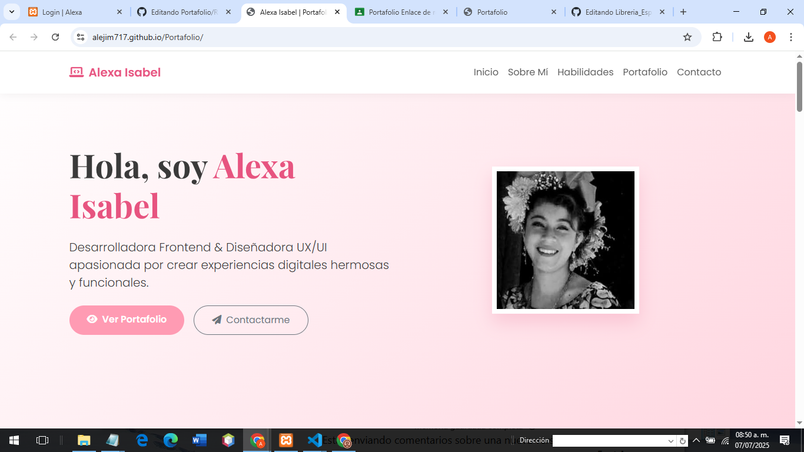
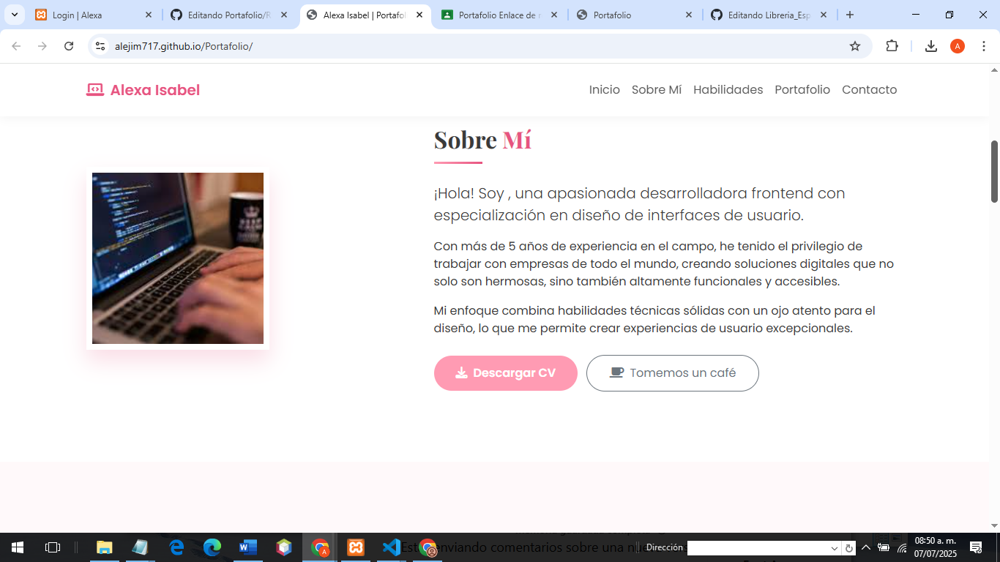
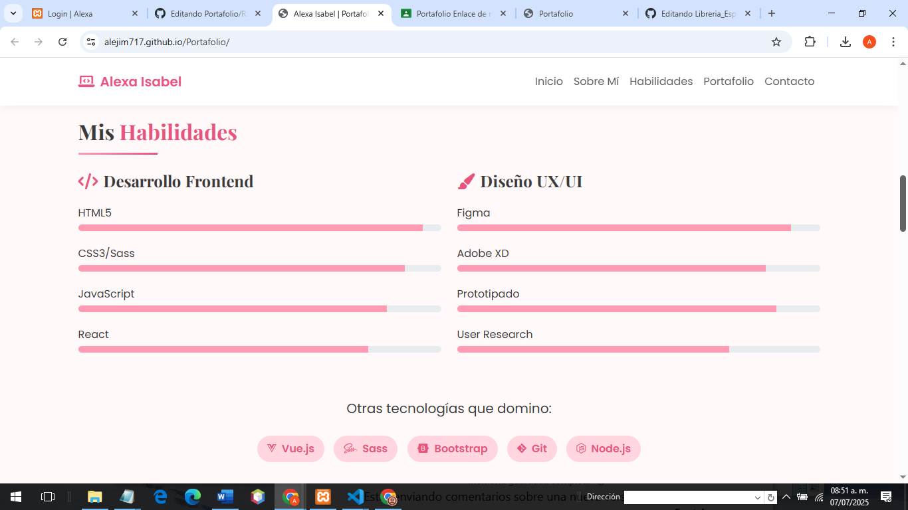
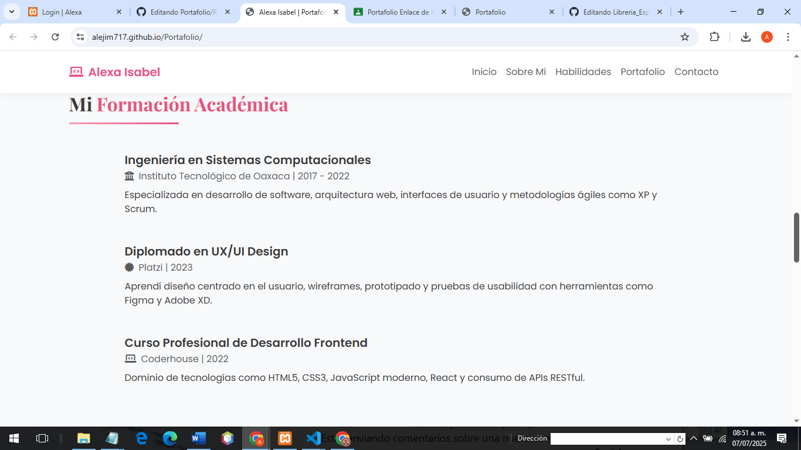
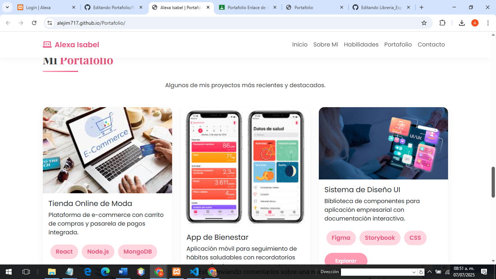
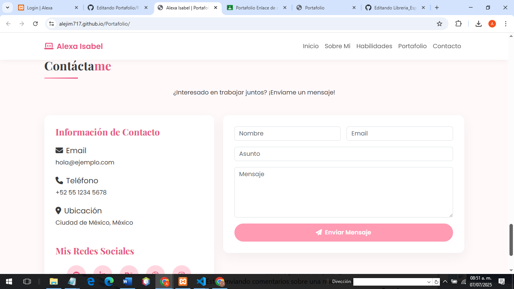

# Portafolio
## Portada
Nombre del proyecto:
Portafolio 
Estudiante : Rodriguez Hernández Alexa Isabel
Verano programación web 2025

## Descripción:
Este proyecto web es un portafolio, diseñado para presentar sus habilidades, experiencia académica y proyectos destacados en desarrollo frontend y diseño UX/UI. Utilizando una plantilla y ajustando segun sea nuestro gusto y/o necesidas

### Descripción del proyecto
Menús que la componen (Navbar):
El sitio está estructurado con un menú de navegación fijo en la parte superior que permite desplazarse entre las siguientes secciones:

Inicio – Presentación personal con imagen y botones para ver portafolio o contactar.

Sobre Mí – Breve biografía y botón para descargar CV.

Habilidades – Lista de conocimientos técnicos en frontend y diseño UX/UI con barras de progreso.

Educación – Línea del tiempo con la formación académica y cursos realizados.

Portafolio – Proyectos desarrollados con imagen, tecnologías utilizadas y botón para ver más.

Contacto – Formulario para enviar mensajes y redes sociales.

Footer – Información de derechos reservados.

### Plantillas y tecnologías utilizadas:
Plantilla personalizada con estructura responsive.

Bootstrap 5: para diseño responsivo, navbar, botones y grid.

Font Awesome: para los íconos del menú y redes sociales.

Google Fonts: para tipografías .

Estilos personalizados: a través del archivo portafolio.css.

### Descripción de cada sección:

**Inicio**
Encabezado con presentación breve.

Imagen de perfil.

Botones de acción (ver portafolio / contactarme).

**Sobre Mí**
Imagen personal trabajando.

Texto introductorio sobre la experiencia profesional y enfoque.

Botones para descargar CV o tomar un café virtual.

**Habilidades**
Dos columnas:

Desarrollo Frontend (HTML, CSS/Sass, JS, React)

Diseño UX/UI (Figma, Adobe XD, Prototipado, User Research)

Barras de progreso para visualizar nivel.

Lista adicional de tecnologías dominadas (Vue.js, Git, Node.js, etc.).

**Educación**
Línea del tiempo con tres elementos:

Ingeniería en Sistemas (ITO)

Diplomado en UX/UI (Platzi)

Curso de Frontend (Coderhouse)

**Portafolio**
Muestra 3 proyectos destacados:

Tienda Online de Moda

App de Bienestar

Sistema de Diseño UI

Cada tarjeta muestra imagen, descripción breve, tecnologías usadas y botón para ver más.

**Contacto**
Sección dividida en dos columnas:

Información de contacto (email, teléfono, ubicación, redes).

Formulario de contacto (nombre, email, asunto, mensaje).

### Funcionamiento

